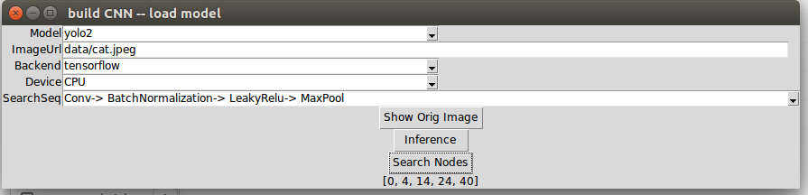
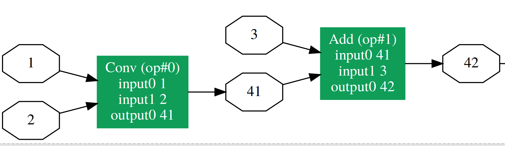

# Using ONNX for Inference (YOLO2, VGG)
convert YOLO2 and VGG models of PyTorch into ONNX format, and do inference by onnx-tensorflow or onnx-caffe2 backend.   

## GUI-demo
open terminal under this root folder, and run command line:
```shell
python GUI.py
```
Edit image path(can be local or URL) and select model, beckend, and device. Then press `inference` button.
The inference result and time cost will be shown on screen. 

And you can change SearchSeq and then press `Search Nodes` button. It will search the whole graph and return a list of starting node indexes of matched sub-graph.


## API-demo
Python code: 
- modelName is selected from ['yolo2', 'vgg11', 'vgg13', 'vgg16', 'vgg19']
- backend is selected from ['tensorflow', 'caffe2']
- device is selected from ["CPU" , "CUDA:0"]
```python
from Inference import Inference
a  =  Inference(modelName="yolo2", imgfile = './data/dog.jpg', backend="tensorflow", device="CUDA:0")
str_ = a.predict()
```
Using above python code to get prediction result (the returned string)
```python
print (str_)
```
>
>truck: 0.934710 
>bicycle: 0.998012 
>dog: 0.990524 
>

for more detail [[please refer this]](4.Inference_test.ipynb)

## ONNX-IR Visualization (Optional)

Need to install pydot and graphviz first, and run command lines:
```shell
mkdir dot svg
python net_drawer.py --input "onnx/vgg19.onnx" --output "dot/vgg19.dot" --embed_docstring
dot -Tsvg "dot/vgg19.dot" -o "svg/vgg19.svg"
```
for more detail [[please refer this]](5.Visualization.ipynb)




## Ref. Requirements & Develop Environment
- python >= 2.7
- pytorch >= 0.3.0.post4
- onnx >= 1.0.1
- tensorflow >= 1.6.0 and onnx-tf 
- caffe2 and onnx-caffe2 (optional, if you only use Tensorflow and won't use Caffe2 for inference)
- numpy >= 1.14.2
- pillow >= 5.0.0
- pydot and graphviz (optional, for ONNX-IR Visualization)

# Tutorials - Step by Step

## Object Detection - YOLO2
#### Step 1 - Save YOLO model from PyTorch to ONNX
1.yolo2_pytorch_onnx_save_model.ipynb
[[Please refer this]](1.yolo2_pytorch_onnx_save_model.ipynb)

#### Step 2 - Load YOLO model from ONNX and Infer with Caffe2 or Tensorflow
2.yolo2_pytorch_onnx_load_model.ipynb
[[Please refer this]](2.yolo2_pytorch_onnx_load_model.ipynb)

## Image Recognition - VGG
#### Save model from PyTorch to ONNX, Load model from ONNX, and Infer with Caffe2 or Tensorflow
3.vggnet_onnx.ipynb
[[Please refer this]](3.vggnet_onnx.ipynb)
