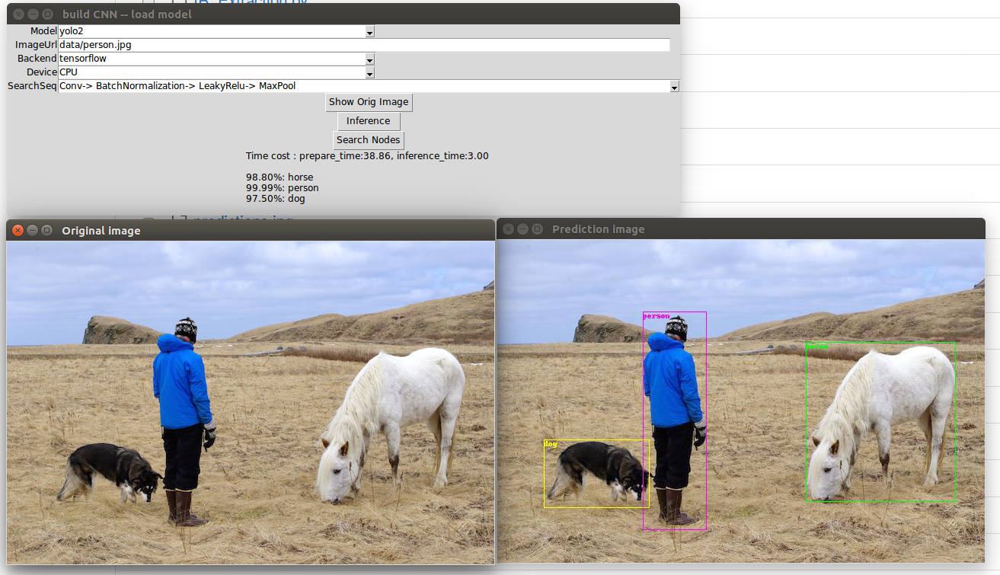

# Objective - Using ONNX for Inference
convert YOLO2 and VGG models of pytorch into ONNX format, and do inference by onnx-tensorflow or onnx-caffe2 backend.   

## GUI-demo
Command line:
```
python GUI.py
```
Edit image path(can be local or URL) and select model, beckend, and device. Then press `inference` button.
The inference result and time cost will be shown on screen. 


## API-demo
[[Please refer this]](4.Inference_test.ipynb)

## Ref. Requirements & Develop Environment
- python >= 2.7
- pytorch >= 0.3.0.post4
- onnx >= 1.0.1
- tensorflow >= 1.6.0 and onnx-tf
- caffe2 and onnx-caffe2
- numpy >= 1.14.2
- pillow >= 5.0.0

# Tutorials - Step by Step
## Object Detection - YOLO2
### Step 1 - Save YOLO model from PyTorch to ONNX
[[Please refer this]](1.yolo2_pytorch_onnx_save_model.ipynb)

### Step 2 - Load YOLO model from ONNX and Infer with Caffe2 or Tensorflow
[[Please refer this]](2.yolo2_pytorch_onnx_load_model.ipynb)

## Image Recognition - VGG
### Save model from PyTorch to ONNX, Load model from ONNX, and Infer with Caffe2 or Tensorflow
[[Please refer this]](1.yolo2_pytorch_onnx_save_model.ipynb)
